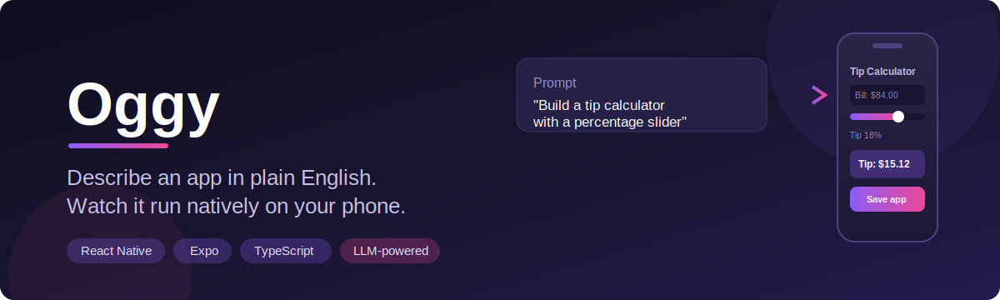
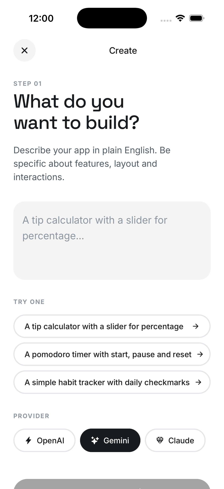
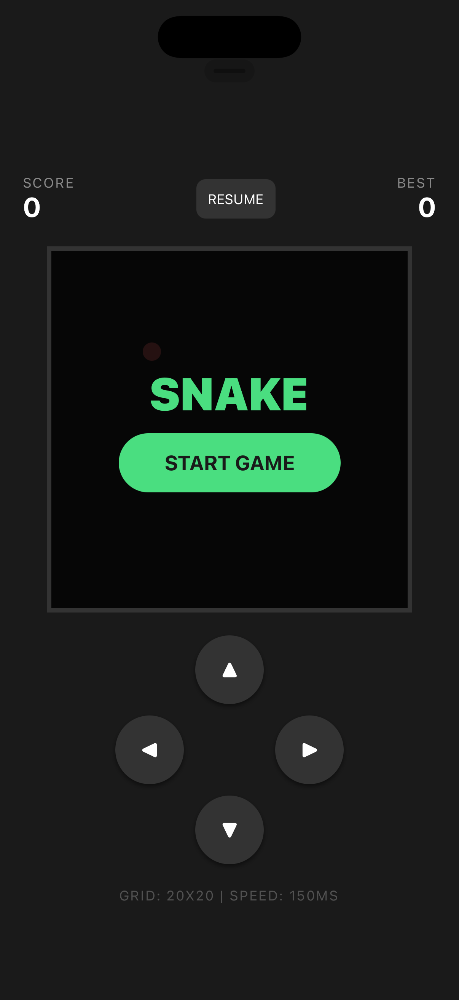
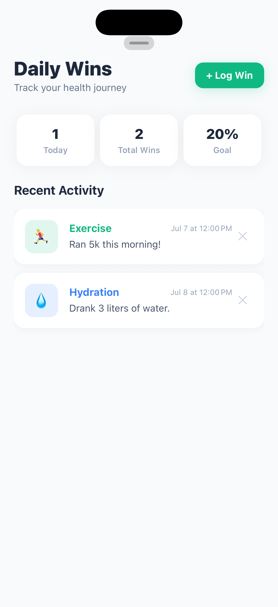
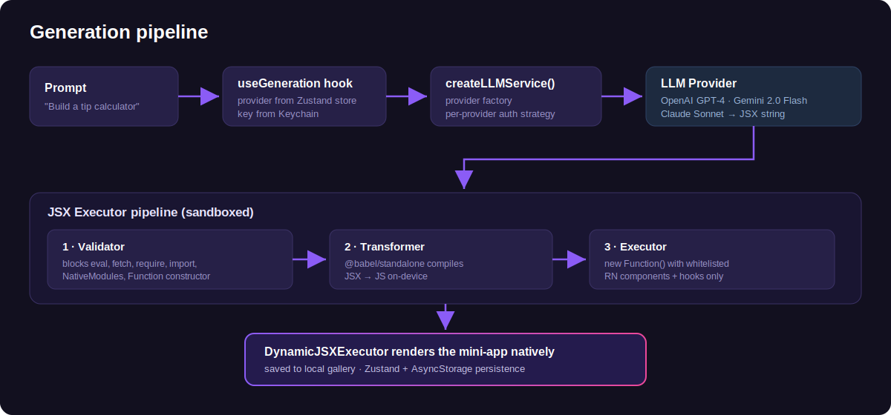

<p align="center">
  
</p>

<p align="center">
  
  
  
  
  
</p>

# Oggy

Describe any app in plain English and watch it come to life on your phone. Oggy uses LLMs to generate fully functional React Native mini-apps from natural language prompts — rendered **natively**, not in a webview.

> "Build a tip calculator with a percentage slider" → a working native app on your phone in seconds.

## Screenshots

| Create — prompt to app | Preview — Snake game | Preview — habit tracker |
|:---:|:---:|:---:|
|  |  |  |

## How it works

1. **You describe an app** — "Build a tip calculator with a percentage slider"
2. **An LLM writes the code** — Oggy sends your prompt to your chosen provider with a system prompt that constrains output to safe, self-contained React Native JSX
3. **It runs instantly** — The generated JSX is validated, transformed via Babel, and executed inside a sandboxed context with whitelisted React Native components
4. **Save and revisit** — Save your creations to a local gallery and run them anytime

## Architecture

<p align="center">
  
</p>

**Whitelisted components:** View, Text, TextInput, TouchableOpacity, ScrollView, FlatList, StyleSheet, Alert, Button, Image, ImageBackground, Switch, Pressable, ActivityIndicator, Modal, SafeAreaView, Animated

**Whitelisted hooks:** useState, useEffect, useRef, useCallback

## Supported providers

| Provider | Model | Auth |
|----------|-------|------|
| **OpenAI** | GPT-4 | API key (header) |
| **Google** | Gemini 2.0 Flash | API key (query param) |
| **Anthropic** | Claude Sonnet 4 | API key (header) |

Bring your own API key. Keys are stored in the device Keychain via `expo-secure-store`.

## Screens

- **Home** — 2-column gallery grid of saved apps + FAB to create
- **Settings** — Provider selection, API key management with connection testing
- **Create** (full-screen modal) — Pick provider, write prompt, generate, inline preview, save
- **Preview** (stack screen) — Full-screen runner for saved apps with delete option

## Getting started

### Prerequisites

- Node.js 18+
- iOS Simulator (Xcode) or a physical device with [Expo Go](https://expo.dev/go)

### Install and run

```bash
git clone https://github.com/Alg0-labs/oggy.git
cd oggy
npm install
npx expo start
```

Press `i` for iOS Simulator or scan the QR code with Expo Go.

### Add an API key

Open the **Settings** tab, tap a provider, enter your key, and hit save. Use the **Test** button to verify connectivity.

## Security

Generated code runs in a constrained execution context:

- No network access (`fetch`, `axios` blocked)
- No module system (`import`, `require` blocked)
- No native bridge access (`NativeModules`, `__native` blocked)
- No code generation (`eval`, `Function` constructor blocked)
- Only whitelisted React Native components are injected into scope

## Tech stack

- **Expo SDK 54** + Expo Router (file-based routing)
- **React Native 0.81**
- **Zustand** — state management with AsyncStorage persistence
- **@babel/standalone** — in-app JSX-to-JS transformation
- **expo-secure-store** — Keychain-backed API key storage

## Roadmap

- [ ] Offline mode — run Gemma 4 (E4B/E8B) on-device via MLX-Swift
- [ ] App editing — modify saved apps with follow-up prompts
- [ ] Component RAG — extract reusable components from generations to improve future output quality
- [ ] Share apps — export mini-apps as shareable links

## License

MIT
